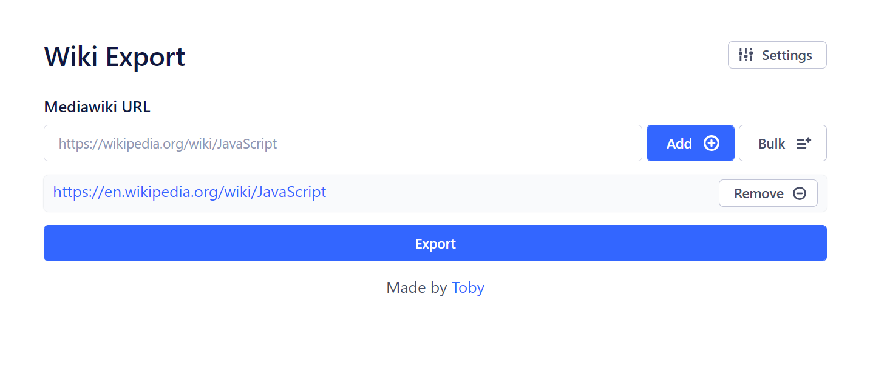

# wiki-export

A **single-runtime**, **customizable**, and **lightweight** wikipedia (mediawiki) scraper and exporter.
Try it live at [wiki-export.com](https://wiki-export.com)

<p align="center">
  
</p>

## About

Created over the course of two days, this side project was intended to assist in quickly generating pdf files that could be easily printed to create paper binders. When using the built-in print functionality, wikipedia includes information that is typically not needed for printouts such as citations. Do not expect updates; however, pull requests are welcome.

## How it Works

1. Wikipedia pages are collected and parsed on the client side with React, Next.js, yup, and [Evergreen UI](https://evergreen.segment.com/)
2. The links are sent over an http request to the next.js api route
3. The "backend" loads the given pages using puppeteer, applies transformations, and exports as pdf files
4. The generated pdf files are zipped using jszip and returned to the user over the same http request

## Usage

This project can be deployed using a serverless solution like vercel; however, due to the [limits](https://vercel.com/docs/concepts/limits/overview#serverless-function-payload-size-limit) on the Lambda functions that power them, you will not be able to export that many pages at once.

Therefore, it is recommended that you deploy it via the supplied docker file/container.

```
docker run --rm --name wiki-export -p 3000:3000 ghcr.io/tobythomassen/wiki-export:latest
```

Alternatively, you can build your own image with `docker build -t wiki-export .`

## License

This project is licensed under the terms of the GNU AGPLv3 license

See [LICENSE](LICENSE) for more information.
